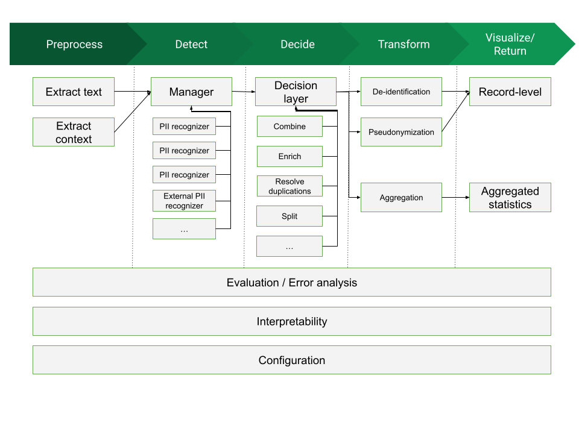

# PII data specification

## Version 0.4.0

<!-- START doctoc -->
<!-- END doctoc -->

## Overall architecture

The general structure of a framework dealing with PII management could be visualized as the following diagram:



There are up to four processing blocks for such a framework:

1. **Preprocess**: block whose mission is to read a document in an arbitrary format (a Word Document, a Web page, a PDF file, etc) and produce a normalized version, retaining only a simplified version of the high-level structure and all the text data.
2. **Detect**: block in charge of processing input data (usually in text format) and performing detection of candidates to be assigned as PII data. This block uses as input:
    * **source document:** we will consider a normalized data format that conveys the raw text contents, together with some structural information. (which can provide useful hints to the PII Detection modules about the relations between text chunks)
    * **configuration information**: specification of contextual elements affecting detection (e.g. text language, applicable countries, etc)
    * **component information**: the set of available PII Detectors that can be used (assuming we take a modular approach, there might be a database of “pluggable modules” we can use for PII detection). Each Detector will define the type and parameters of PII that can detect.
3. **Decide**: block that takes a number of PII candidates, as produced by the Detection block, and consolidates that information, producing as final result the set of PII elements in the text that need to be addressed. In the process it might combine PII candidates, choose among overlapping PII candidates, reject others, etc. This block uses as input:
    * Candidate list: A list of detected PII candidates
    * Configuration information, as provided by the Decision block (language, countries, etc)
    * An optional purpose/application scenario, to guide the decisions
    * _Context information, as defined in its own configuration. This might include: requirements on PII specificity, sensitivity and scarcity, applicable regulations, etc_
4. **Transform**: This is the block that takes the decided PII entities, and acts upon them, depending on the intended purpose. There can be different Transformation blocks, all of them sharing the same interface but providing different outcomes. Some examples are:

    * _De-identification_: removal of PII data from source material, possibly
	  replacing it with anonymous placeholders
	* _Pseudonymization_: substitution of PII information by opaque identifiers
	  that preclude attribution to subjects
	* _Aggregation_: compute aggregates of PII elements for e.g. statistical
      purposes, or to identify possible inconsistencies.
	* _Auditing and explanation_: track PII decisions and be able to explain
      them.
    * _Anonymization_: modify the text to eliminate decided PII entities. Depending on options they can be replaced by placeholders, dummy values, generated fake PII data, etc

5. **Visualize, evaluate, interpret**:

    * _Record level_: enable browsing the input data and highlight/examine PII decisions.
    * _Evaluation_: provide the capability to assess the performance of detection and/or decision, possibly by using a ground truth evaluation dataset, and estimate precision values.
    * _Interpretability_: Provide the capability to interpret the decision process (e.g. why a certain span was decided to be detected as PII and additional metadata on the decision)
    * _Analytics_:  provide the capability to extract and visualize aggregated statistics on decided PII and their associated parameters

Note that the full process of performing *PII recognition* on documents could
be considered as the combination of the steps *Detect* + *Decide*
 * *Detection* is the first phase, in which matches are done
 * *Decision* is the second phase that consolidates all detected PII instances


### Description of possible use cases

This is a non-comprehensive enumeration of possible transformation use cases:

* PII redaction prior to ML model training (e.g., prior to training LLMs)
* Pseudonymization of clinical notes for secondary analysis
* Realtime redaction of PII from system logs
* Redact textual PII from images, forms, PDFs etc.
* PII de-identification on semi-structured data, e.g., specific areas in a JSON file, XML, free text columns in tabular data.
* Semi-automated PII removal (human in the loop)
* Classify documents based on whether they contain PII


## Specification interfaces

The main interfaces to be specified are those that act as boundaries between architecture blocks:

* interface between preprocessing and detection
* interface between detection and decision
* interface between decision and transformation

It might be possible to also define some interfaces internal to one block, so that the block can be decomposed into modular elements (e.g. for pluggable detectors inside the Decision block)


## Specification types

At any given interface, we can envision three types of specification:

1. A **data specification**: syntax & semantics of the data structures that will be sent through one of the interfaces
2. A **program specification**: program interfaces to let components call or be called across the interfaces. This would need to fix an initial default programming language (e.g. Python) to be able to instantiate such program interface; additional languages might be defined later
3. An **API specification**, as a programming language-independent way of interchanging data information across interfaces. This would use a definition such as an [OpenAPI](https://spec.openapis.org/oas/latest.html) specification so that it can be applicable regardless of the programming language; to this aim the _data specification_ would be instantiated into a JSON schema or similar

Note that this is a nested structure: the _Data specification_ is the minimum required element; on top of that we can add the _Program specification_ (or a number of them, for different programming languages) and over it the _API specification_ (or we could also add the _API specification_ directly over the _Data specification_, and leave a program specification undefined)


## Data Specification

Taking the interfaces of the Detect block as a central point, we can define:

* as _input_, a **Source Document**, either generated directly or via the
  Preprocessing block (note that this source document is the _output_ data
  specification for the Preprocessing block)
* as _output_, a **PII collection**, containing a description of PII
  elements. A subspecification inside it is the **PII Detector**, describing a
  block _producing_ PII elements.

The Decision block uses the PII Collection data specification as both input
and output (with an enlarged data specification in output, incorporating
additional information resulting from the decision). Then the Transform block
uses both a PII collection and a Source Document as input; its output depends
on the transformation done.

The Preprocess block defines its output data specification (as a Source
Document), but its input data specification is not standardized, and will
depend on the available modules and their capabilities to process document
formats.


## Source document

We need to balance two conflicting requirements:

1. an easy format to work with: it needs to be machine-processable but also amenable to human editing and reading
2. an expressive format: able to reflect (at least to some level) the document structure, since that structure might be important to connect PII elements

There are quite sophisticated “Layout” formats for text documents: Word documents (Office Open XML aka OOXML), PDF files, RTF, ODF (Open Document), etc. They are very complex, with specifications compressing many pages, since they allow the complete and precise specification of all aspects of document layout, structure and presentation. They would, of course, offer the greatest nuance in determining the relationships between the text chunks they contain[^1], but would be too difficult to handle for our purpose of consolidating a data interchange format for PII processing that has “reasonable” complexity. There are also image documents (PDF, PNG, JPEG, …), with non-textual PII like people's faces, fingerprints, medical scans or signatures, which we do not consider at all at this point.

Instead, we are aiming at a simpler solution. As a very minimum, a document
can be considered as _a collection of text chunks_. How those chunks are
structured is what generates the model to be represented. In general terms, we
will consider three main document model types:

* a **sequence** model: a document is composed by a list of consecutive chunks
* a **tree** model: a hierarchical top-down structure relates text chunks one to another, so that chunks can be nested
* a **table** model: a 2-D structure (i.e. something that can be expressed as rows and columns, with the implicit assumption of some semantic linking across those rows and columns)

There might be mixed documents, which contain e.g. both tree and table sections, or other structures.

The general shape of a source document is then given by a document metadata
header plus a set of document chunks. A chunk is intended to contain a portion
of the document with self-contained data; the exact shape of a chunk depends on
the document model type.

### Document header

The document header contains metadata applicable to the full document. It is
divided into sections, each one containing dictionary-like metadata.

The following sections are defined:
 * `document`: contains relevant information (metadata) describing this
   particular document; a non-exahustive list of possible fields (all of them
   optional except `id`) is:
    - `id`: an arbitrary string acting as an identifier for the document. If
	  the document belongs to a dataset, it should be unique across all
	  documents in the dataset.
    - `type`: the model type for the document (_sequence_, _tree_, _table_)
      The default value, when the field is not present, is _sequence_
    - `date`: an ISO 8601 date defining the creation date of the document
    - `main_lang`: an ISO 639-1 code describing the language the document is
	  in.
      For documents containing more than one language, it should express the
      most frequent language in the document.
    - `other_lang`: a list of ISO 639-1 codes indicating other languages
	  present in the document
    - `country`: a list of one or more ISO 3166-1 country codes for which the
      document may be applicable (this might be used to further define the
      applicability of country-dependent PII elements)
    - `title`: a title for the document
 * `dataset`: metadata describing the whole dataset this document belongs to
   (so their fields are applicable to _all_ documents in the dataset).

Additional sections may be defined for specific document types.


## Iteration interfaces for source documents

Once the Source Document has been specified, we can define program interfaces
to _iterate_ over a document, producing document chunks. Two different iteration
interfaces have been defined for this data structure:
 * **structural iteration**: this is the native iteration for the document,
   which produces elements revealing its intrinsic data structure (therefore the
   objects delivered in the iteration may differ across document types,
   _sequence_, _table_, _tree_)
 * **full iteration** (or flat iteration): this iteration interface flattens the
   document structure and always delivers a linear sequence of chunks,
   regardless of the document type.

An additional difference between the two iteration modes appears in the 
content of the contextual information delivered within each chunk:
 * In structural iteration, the context fields for a chunk will not contain any
   information regarding the rest of the document (since the structure is
   already given by the iteration), only semantic information inherent to the
   chunk
 * A chunk context in full iteration, however, may contain context fields that
   refer to other chunks or to the full document (depending on its structure).

The following sections detail these iteration interfaces for each document type.


### Sequence documents

#### Structural iteration

A sequence document is divided into independent, adjacent chunks. Each chunk
could be conceptually considered as one document paragraph (though that split is
not strictly defined; it might be possible for a document to contain chunks
spanning more than one typographical paragraph, or to split a very long
paragraph into more than one chunk).

Structural iteration for these documents is simply a linear sequence of
_chunks_. Each chunk is a dictionary containing up to three elements:

* **id**: an arbitrary string that should be unique per document. Its mission
  is to make it easier later on to map detected PII instances to the chunk
  they are part of
* **data**: a text section that contains the textual contents of the chunk. It
  will be a string containing UTF-8 raw text. It can contain newlines, blank
  lines or spacing (to be considered as part of the text structure), but no
  formatting or layout contents (it is assumed that exact formatting & layout
  is lost when creating the source document for PII processing – this is a
  price we pay for simplicity)
* **context**: an optional element that, when present, contains a dictionary
  of context fields specific for the chunk, intended to provide additional
  data to help in the detection and decision process. Note that the context is
  not formally part of the chunk, and the possible fields present are not
  specified (they depend on the document original format and on the capabilities
  of the software that extracts it).

In its simplest form, the content of one chunk is, as mentioned, a document
paragraph. But exactly how those paragraphs are determined is
application-dependent. And in any case joining together the data elements
in all chunks should recover a text representation of the original document.


#### Full iteration

The full iteration for sequence documents is quite similar to the structural
iteration (given that the document structure is flat). It produces a series of
chunks, each one of them having up to three elements:

* **id**: a unique string for the chunk (there is no guarantee that is the same
  as the id in structural iteration)
* **data**: the same contents as in the **data** field in structural iteration
* **context**: an optional element that, when present, contains a dictionary
  with the same fields as in structural iteration, **plus** up to three types
  of context structure, all of them optional:
   - _global_: it will be a link/transposition of the information in the
     document header, as described [above](#document-header)
   - _before_: the data content from the chunk preceding this one
   - _after_: the data contents from the chunk following this one

The addition of these three new context elements (over the possible context
already present in the structural iteration) allows a module processing a full
iteration to, in most cases, treat each chunk as an isolated data piece,
avoiding the need to maintain and update document state as chunks are processed.

Note that the context element of the chunk is a logical one, and need not be
present in a static representation of the chunk, or when sent or streamed,
since it would repeat information unnecessarily. Instead, it would be generated
on the fly by an appropriate PII processing module, so that processing
elements down the line have direct access to that context when processing a
chunk, even when in streaming mode.


### Tree documents

In this document type we are trying to preserve two main structural relations between text chunks:

1. an “_is-contained-in_” relation: a text chunk can be considered as semantically contained within another chunk
2. an “_is-next-to_” relation: a text chunk has a relation of being after or before another text chunk

These two relationships can be nested and combined at will. They alone can be enough to describe many of the links that we could need to establish between text chunks (not all of them, but hopefully enough for PII determination).

#### Structural iteration

* A document is considered as a sequence of _subtrees_
* The tree is split by first-level branches (chapters/sections); each element
  produced when iterating is either
    - an isolated top-level paragraph
	- a full subtree, which contains _nested_ elements, according to the
	  hierarchy. Each element (chunk) in the subtree can contain a (text)
	  payload, a subtree of elements, or both
* Iteration produces the sequence of subtrees (a subtree is typically rendered
  as a nested dictionary)

When iterating, then:
* A document produces a sequence of chunks
* Each chunk contains a small dictionary with 2 to 4 elements:
    1. **id**: an arbitrary string that should be unique per document (same as
       for sequence documents)
    2. **data**: a text section that contains the textual contents of the
       chunk (same as for sequence documents)
    3. **context**: (optional) a section that, as in sequence documents,
	   may contain document-specific context fields for the chunk
	4. **chunks**: (optional) if the current chunk contains subchunks below in the hierarchy, this element contains a sequence of them. This can be nested as needed.

A chunk position in the document hierarchy (its “level”, with 1 being a top-level chunk) could be deduced unambiguously from its location in the nested sequence of chunks.

Note that there is some inherent ambiguity when constructing a document with this model: for the same document, the decision on whether two blocks should be considered “next-to” or “included-in” is not always univocal, and in some cases the content of the text blocks is what gives the semantics away. It is hoped that these variants should not affect the result of any PII Detector processors significantly.

This specification would be enough to roughly translate the overall structure of a Word document, a Web Page or a PDF file, assuming that structure can be mapped into this simple hierarchy (some documents are of course more complex than that). Also, a simple raw text document can be easily modeled as a single top-level text chunk.

#### Full iteration

The full iteration has similar mechanics as the full iteration in sequence
documents:
 * The document tree is traversed depth-first, and all data elements available
   when traversing generate a chunk
 * Iteration then produces a linear sequence of these chunks
 * A chunk contents has the same elements as in sequence documents: `id`,
   `data` and `context` (with no nested chunks)
 * The context elements have also the same _global_, _before_ and _after_ fields
   **plus** one additional field:
     - _section_: contains the text/data for the top-level chunk in the
       subtree this chunk belongs to (typically it will contain the
       sections/chapter title, but it depends on the stucture of the document)
 * Note that here _before_ and _after_ may refer to chunks above/below in the
   tree, or in adjacent subtrees


### Table documents

A Table Source Document is one in which the structure has two dimensions, i.e.
it is organized mainly as rows and columns (so it can be mapped to a table),
which then contain some type of data. Its semantic premise is that there exists
some kind of relationships along rows and along columns, relationships that may
have implications in terms of PII detection and required processing approaches.
Examples of tabular documents are Excel files, or CSV files.

One particular feature of certain table documents is that they can be very
large, since they may contain huge quantities of data; hence there should be a
way in which they can be processed by chunks (i.e. as streaming objects),
without the need to hold all their contents at once.

As all source document model types, a table document is considered as a
document header, plus a sequence of document chunks.

The document header corresponds to the already defined specification, with one
modification: in addition to the already defined `document` and `dataset`
sections, there may also be a `column` section, providing specific information
for each of the columns in the document (considered in sequential order). It
could contain up to two subelements:
* `name`: the column names, as a list of text strings
* `description`: a description for each column, also as a list of text strings


#### Structural iteration

* A document is considered as a sequence of _rows_
* Each row contains a list of column values, each column value is a string with
  the contents of the corresponding table cell
* Iteration then produces a sequence of chunks, one per document **row**.
* Each chunk contains the three usual fields: `id`, `data` and `context`. 
* `id` and `context`have the same structure and semantics as for the other
  document types
* However, `data` is different: for table documents it contains not a text
  field, but a _list_ of text fields, one per column in the row. Hence the
  `data` field can also be iterated upon.


#### Full iteration

For Table source documents in full iteration mode:
 * A document is considered as a sequence of _cells_
 * Cells are traversed in row-major order, top-to-bottom and left-to-right
 * Traversing produces a linear list of document chunks
 * A chunk contents has the same elements as in sequence documents: `id`,
   `data` and `context`
 * The `data` element contains the contents of a single document cell
 * The context elements have the usual _global_, _before_ and _after_ fields
   **plus** one additional field:
     - _column_: contains the column name and index for the cell in this chunk
 * Note that here _before_ and _after_ refer to the previous & next cell,
   which for the first/last cells in a row will be in another row


## Storage format

As a support file format, we define YAML as the serialized representation
of a Source Document. Those are easy to inspect visually and handle/edit
manually, and also can be processed via automatic tools and packages. The YAML
specification is actually somehow complex, but we would use only a subset of it:
the part strictly needed to support the definitions above
 * sequences, for the sequences of chunks
 * mappings, for each chunk
 * literal block scalars, to hold the text contents of each chunk

YAML is therefore a good candidate for storage and for manual inspection or editing. For online APIs its equivalent representation as JSON might be more appropriate, though the result would be more involved, specially with the need to serialize the text chunks, including newlines and character escaping

A serialized dump of a Source Document will contain then a YAML representation
of the document, stored in a file, database or any repositiry. Its form will
be a dictionary with three elements:
 * `format`: a string identifier that signals the file as being a PII Source
   Document. Its value is `piisa:src-document:v1`
 * `header`: the document general metadata, as explained in [document header](#document-header)
 * `chunks`: a list of all the chunks generated in a _structural iteration_ of
   the document

The use of structural iteration allows:
 - the preservation of the document structure, which then can be regenerated
   when the document is read from the file
 - space savings by not including the context fields present only in the full
   iteration

Note that context fields that are present in the structural iteration will _be_
dumped into the file.

The PIISA repository contains:
* [an example](https://github.com/piisa/pii-data/blob/main/test/data/doc-example.yaml) of such a Source Document.
* a [Python module](https://github.com/piisa/pii-data) developed to read &
write this format, as well as produce structural & full iterators from it.


## PII Collection

A PII collection is the result of running a set of PII detectors on a source document. This result takes the form of a header + a list of detected PII instances.

### Header

The header contains generic metadata that affects all the PII instances in the collection. Elements of this metadata are:

* `date`: a timestamp on when the process was run
* `format`: a string indicating the format the data is in. E.g. `pii:pii-collection:v1`
* `detectors`: a dictionary describing all detectors (i.e. subsystems or packages) employed to produce the list. Each entry has as key a `detectorId` (an arbitrary string), and as value a dictionary with fields
  - `name`: the name of the package
  - `version`: the package version
  - `source`: a string defining the origin of the package (e.g. a vendor or an organization name)
  - `url`: an address used as reference for the package (e.g. a website or a GitHub repository)
  - `method`: an optional string defining the process used for detection, e.g. `Regex`, `NerModel`, `Regex+Context`, `Checksum`, etc

### PII instance

A PII instance describes one recognized PII entity. It can be considered as a dictionary containing three types of information:

* PII Description: set of fields characterizing the instance
  - `type`: a string denoting the broad class of PII this instance belongs to. Typically a set of PII types will be predefined so that it can be shared across systems.
  - `subtype`: certain PII classes may have optional subtypes, which help qualify its meaning. For instance, the `GOV_ID` type might have as subtypes “driving license”, “passport number”, etc
  - `value`: the text string from the document containing the PII Instance, as extracted by the detector
  - `lang`: the ISO 639-1 code of the language the document chunk (and possibly the PII instance) is in
  - `country`: the ISO 3166-1 code of the country that is relevant for the PII Instance, if any. E.g. a `CREDIT_CARD` number PII may have an associated country, while a `BITCOIN_ADDRESS` PII has not.
* PII Location: information used to place the PII instance inside the document it belongs to
  - `docid`: the id of the document (optional, used if the PII Collection refers to more than one document)
  - `chunkid`: the id of the document chunk the PII instance belongs to
  - `start`: position of the start of the PII instance inside the document chunk (measured as number of characters from the chunk start)
  - `end`: position corresponding to _one character beyond_ the end of the PII instance inside the document chunk (note that if the PII instance is right at the end of the chunk, this value will point beyond the chunk). The relation _end = start + length(value)_ always holds
* PII Detection: information characterizing the detection process (it can help later in the evaluation by the Decision module)
  - `detectorid`: the identifier for the detector that produced this PII instance, using the key defined in the Collection header
  - `score`: an optional floating point number between 0.0 and 1.0 that gives a measure of the confidence of the Detector on this PII instance. Each detector has its own way of assessing such confidence, so scores are not necessarily comparable across detectors.

### File format

When formatting a PII Collection for storage or transmission, any format capable of preserving its structure can be used. For the ease of compatibility with most REST-type interfaces, two formats can be proposed:

* **full format**, for storage or local processing: contains the PII Collection as one single JSON object with two subobjects: `metadata` and `piiList`
* **streaming format**: it uses NDJSON (aka JSONL) to send the data as separate, newline-delimited chunks:
  * the first line contains the collection metadata, as a JSON object
  * the rest of the lines contain the list of PII instances, one per line, each one containing a JSON object

Both formats carry the exact same information; they only differ in its structure

Two examples of the format are:

* Full format:

  ```
  {
    "metadata": {
      "date": "2022-05-18T15:00:01+00",
      "format": "pii:pii-collection:v1",
      "detectors": {
        "01": {
           "name": "pii-manager",
           "version": "0.6.0",
           "source": "PIISA",
           "url": "https://github.com/piisa"
        },
        "02": {
           "name": "presidio",
           "version": "1.2.2",
           "source": "Microsoft",
           "url": "https://microsoft.github.io/presidio/"
        }
      }
    }
    "pii_list": [
      {
        "type": "CREDIT_CARD",
        "value": "4273 9666 4581 5642",
        "lang": "en",
        "chunkid": "36",
        "pos": 25,
        "detectorid": "01",
        "score": 1.0
      },
      {
        "type": "GOV_ID",
        "subtype": "SSN",
        "value": "536-90-4399",
        "lang": "en",
        "country": "us",
        "chunkid": "12",
        "pos": 102,
        "detectorid": "02"
      },
      {
        "type": "GOV_ID",
        "subtype": "NIF",
        "value": "34657934-Q",
        "lang": "es",
        "country": "es",
        "chunkid": "1",
        "pos": 10,
        "detectorid": "02"
      }
    }
  }
  ```

* Streaming format:

  (note that this example shows additional newlines not present in the file itself)

  ```
  {"date":"2022-05-18T15:00:01+00","format":"pii:pii-collection:c1","detectors":{"01":{"name":"pii-manager","version":"0.6.0","source": "PIISA", "url":"https://github.com/piisa"},"02":{"name":"presidio","version": "1.2.2","source":"Microsoft","url":"https://microsoft.github.io/presidio/"}}}
  {"type":"CREDIT_CARD","value":"4273966645815642","lang":"en","chunkid":"36","pos":25,"detectorid":"01","score":1.0}
  {"type":"GOV_ID","subtype":"SSN","value":"536-90-4399","lang":"en","country":"us","chunkid":"12","pos":102",detectorid":"02"}
  {"type":"GOV_ID","subtype":"NIF","value":"34657934-Q","lang":"es","country":"es","chunkid":"1","pos":10",detectorid":"02"}

  ```

## Notes

[^1]: Though the document formatting options can be used in many different ways, not all of them with semantic meaning
